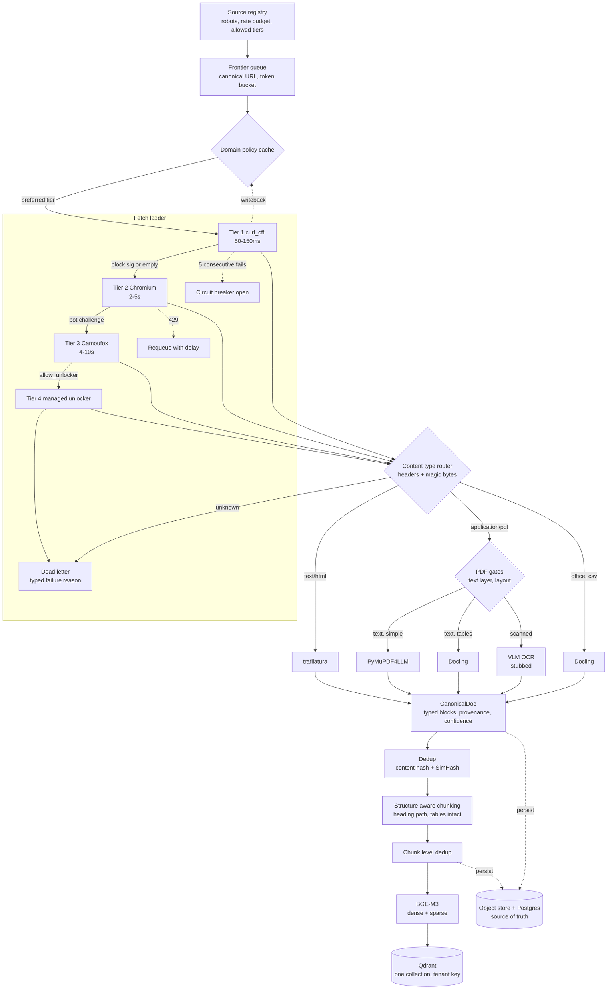
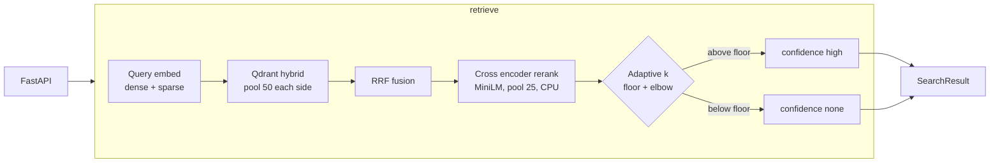
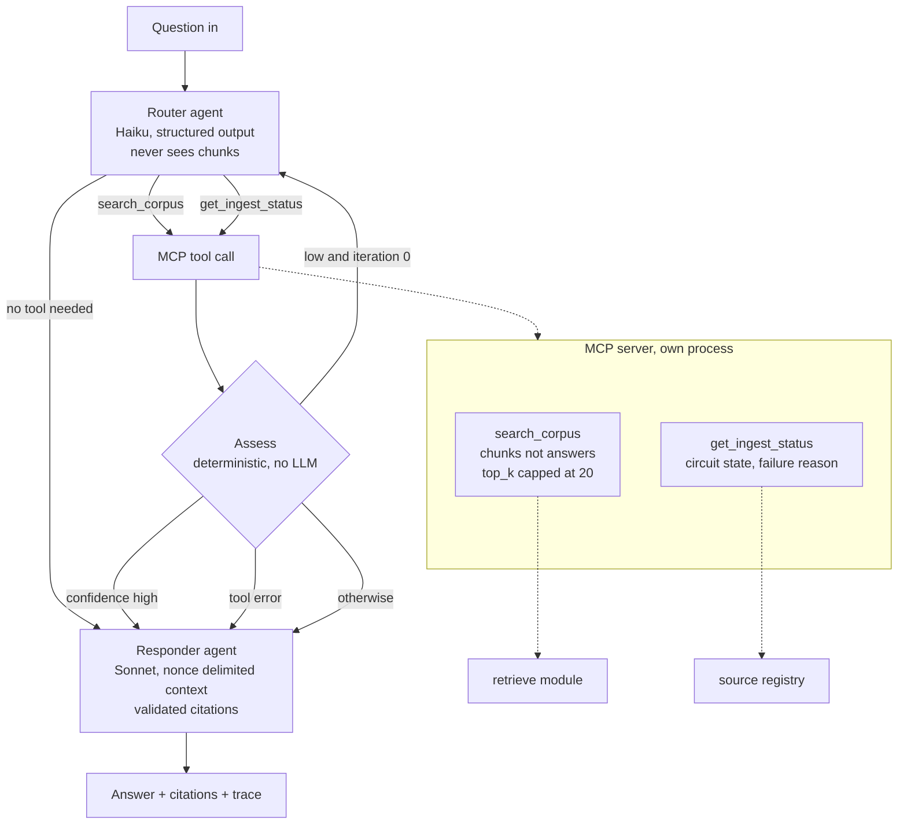

# Architecture

Diagram source lives here so it is versioned with the code and updated in the
same commit. Mermaid renders on GitHub and imports into Lucidchart directly.
Export a PNG from Lucidchart for submission.

## 1. Ingestion, fetch through index

## 2. Query path

## 3. MCP and agent layer

## Boundaries worth naming on the diagram

**The narrow waist.** Every extractor emits `CanonicalDoc`. Chunking does not
know which parser ran. Swapping an extractor changes nothing downstream.

**The MCP boundary.** Tenant is injected server side and is absent from every
input schema. `top_k` is capped in the schema. The surface is read only.

**The injection boundary.** The router reads the question only. The responder is
the sole node that touches scraped text. That is why the router is immune to
injection by construction rather than by instruction.

**Source of truth.** Qdrant is a derived index. `CanonicalDoc` and chunks live
in object storage plus Postgres, which is what makes a model swap a backfill
instead of a re-scrape.

## Export

1. Copy a block above into Lucidchart, Import, Mermaid
2. Adjust layout, export PNG to `docs/architecture.png`
3. Update the Mermaid source in the same commit as any code change that alters
   the flow

The diagram, the code and `DESIGN.md` must describe the same system. Keeping the
source in the repo is how that stays true.
